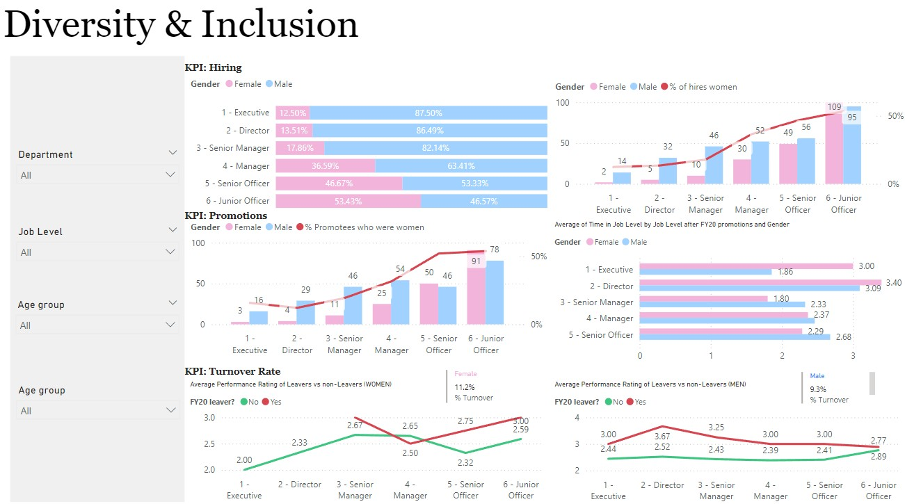
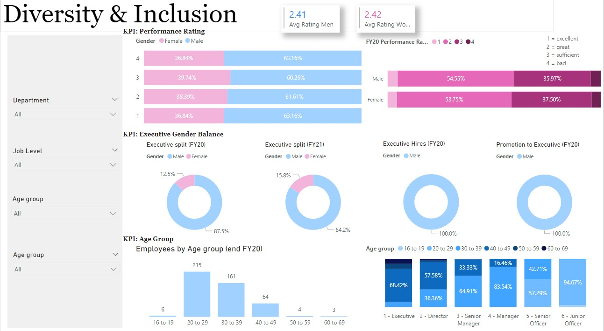

# 📸Project Background

Human Resources at telecom client is highly focused on diversity and inclusion. They've been working hard to improve gender balance at the executive management level, but they're not seeing any progress. As part of my mission, I've identified this as an area where I can provide valuable support. Companies need a workforce of diverse talents and backgrounds to succeed in an increasingly complex and heterogeneous world. Diversity and inclusion are business imperatives, not just nice-to-haves.

# 🎯 Project Objective 

This project is to create a visualization or series of visualization that develop and implement effective strategies that promote gender balance at the executive management level in the telecom industry, enhancing diversity and inclusion.

# 📈 KPI

- Hiring
- Promotions
- Turnover Rate
- Performance Rating
- Executive Gender Balance
- Age Group

# 📊 Data Visualization

- Dashboard1:
    - Display the gender percentage and count for different positions, along with the percentage of women hired.
    - Show the number of promotions for different positions and the percentage of women promoted.
    - Display the average performance rating of leavers v.s. non-leavers (Women & Men).
   
      
   

- Dashboard2:
    - Display the gender percentage with different performance ratings.
    - Display the gender balance of executive title, and the new hiring percetange.
    - Display the number of different age group in each title.
   
      
   

# 🔑 Key Takeaways    

1. Low Hiring Rates for Women at Senior Levels:
The hiring rate for women at the executive level is only 12.5%, with 87.5% being men. This indicates that the entry point for women at this level is significantly lower, making it challenging to achieve gender balance.

2. Limited Promotion Opportunities for Women:
The promotions data shows that the percentage of women promoted at the executive level is also low. The pipeline for women in leadership roles might be weak, which impacts the likelihood of women advancing to executive positions.

3. Longer Tenure in Lower Levels for Women:
Women seem to spend a longer time in lower-level positions before getting promoted. The average time spent in job levels after FY20 promotions indicates that women generally stay longer in their roles compared to men before moving up, which could slow their progression to executive levels.

4. High Turnover Rate Among Women:
The turnover rate for women, particularly in middle management (e.g., Senior Officers), appears to be higher. This could indicate challenges in retaining women as they advance in their careers, reducing the number of women available for promotion to executive roles.

5. Stagnant Executive Gender Balance:
The "Executive split (FY20)" shows that only 12.5% of executives were women, and this increased slightly to 15.8% in FY21. Although there is some progress, it is minimal, indicating persistent challenges in achieving gender balance.

6. Exclusive Male Executive Hires and Promotions:
The "Executive Hires (FY20)" and "Promotion to Executive (FY20)" charts indicate that 100% of executive hires and promotions were men. This complete lack of female representation in these areas is a significant barrier to improving gender diversity at the executive level.

 
